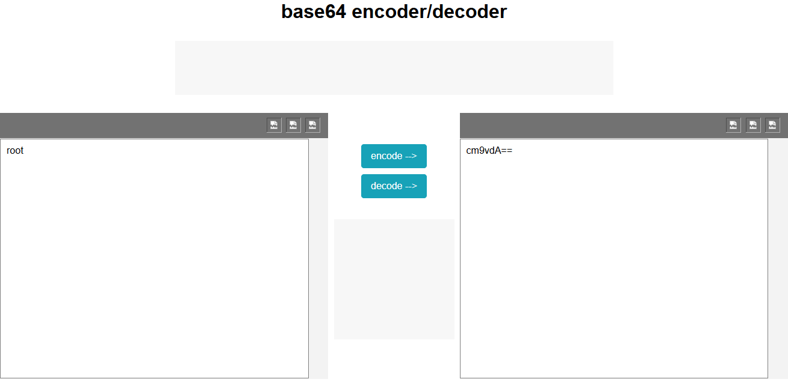

# Pyvmomi-lister (ESXi list buckets, VMs)


### Notes

- Python3 (Anaconda works)


## How It Works?

- pip install pyvmomi
- Add you ESXi IPv4/IPv6 addr to config.json
- Encode you creds & save into config.json
- Ran python main.py


## How do I edit config.json?

You can use https://www.utilities-online.info/base64 to generate your base64 strings


Ex:

You want encode ```root``` to base64 string





You need replace ```line 7``` on creds.json

```json
{

  "ip" : "192.168.1.1",
  
  "creds" : {

    "user" : "cm9vdA==",
    "password" : "cHhndHNqbW50"
  }
}
```

Repeat this steps for ```password```


## Dependencies 

- Pyvmomi